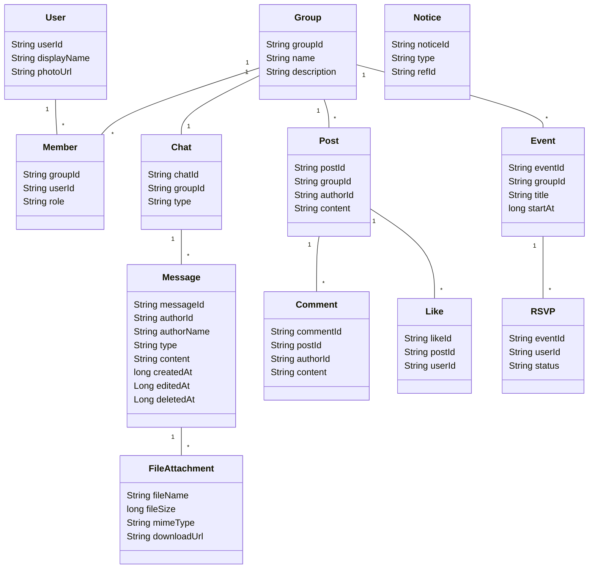

## Danh mục sơ đồ hệ thống (ASCII Markdown)

Lưu ý chung:
- Tất cả sơ đồ dùng khoảng trắng (space), không dùng tab để tránh lỗi hiển thị.
- Các sơ đồ mang tính minh họa, dễ đọc trong code viewer và thuận tiện để vẽ lại bằng draw.io.
- Ký hiệu đơn giản: hình chữ nhật cho tác nhân/thành phần, mũi tên bằng ký tự '-', '>' cho luồng, nhóm bằng khung "+----".


### 1) Use Case Diagram (Tổng quan chức năng chính)
Mô tả ngắn: Các tác nhân chính và chức năng tương tác trong ứng dụng MXH thu nhỏ.

Mô tả chi tiết:
- Người dùng (User) có thể đăng ký/đăng nhập, quản lý hồ sơ, tham gia nhóm, tạo bài viết, bình luận, thả tim, chat, RSVP sự kiện.
- Quản trị (Admin/Owner) có thể duyệt bài, quản lý thành viên, chặn/kick, xem thống kê, nhật ký hoạt động.
- Thông báo hiện tại là in‑app (badge/list). FCM CHƯA tích hợp; có thể bổ sung trong tương lai.
- Firebase (Auth, Firestore, Storage) cung cấp nền tảng xác thực, dữ liệu realtime, lưu trữ tệp.
- Bảo mật ứng dụng bằng mã PIN (app‑lock) là tùy chọn: người dùng có thể bật để khóa/mở khóa ứng dụng sau khi đăng nhập.

```
      +-------------------+                 +----------------------+
      |      Người dùng   |                 |        Quản trị      |
      +---------+---------+                 +-----------+----------+
                |                                       |
                |                                       |
                v                                       v
      +-------------------+                    +-------------------+
      |  Đăng ký/Đăng nhập|<------------------>| Quản lý người dùng|
      +-------------------+                    +-------------------+
                |
                v
      +-------------------+         +-------------------+         +------------------+
      |   Quản lý hồ sơ   |<------->|  Tìm kiếm/Tham gia|<------->|    Quản lý nhóm  |
      +-------------------+         |      nhóm        |         +------------------+
                |                    +--------+----------+                  |
                v                             |                             v
      +-------------------+                   |                    +-------------------+
      |  Tạo bài/ Bình luận|<-----------------+------------------->| Duyệt bài/ Nhật ký|
      |  Thả tim/ Báo cáo  |                                       |  Thống kê         |
      +--------------------+                                       +-------------------+
                |
                v
      +-------------------+           +-------------------+
      |  Chat nhóm/ File  |<--------->|   Sự kiện/ RSVP   |
      +-------------------+           +-------------------+
                |
                v
      +--------------------------------------------------+
      |           Thông báo trong ứng dụng (In‑App)      |
      +--------------------------------------------------+
```


### 2) System Context Diagram (Tổng quan hệ thống)
Mô tả ngắn: Bối cảnh ứng dụng Android và các dịch vụ Firebase liên quan.

Mô tả chi tiết:
- Ứng dụng Android giao tiếp với Firebase Auth (đăng nhập), Firestore (dữ liệu), Storage (tệp); Deep Link hỗ trợ điều hướng. FCM CHƯA được tích hợp.
- Tập tin Firestore Rules và Storage Rules kiểm soát truy cập; Admin console hỗ trợ cấu hình.
- Người dùng tương tác qua mạng di động/Wi‑Fi; CDN Firebase phân phối nội dung nhanh.

```
+-------------------------+           Internet            +-------------------------+
|     Thiết bị Android    |<----------------------------->|      Firebase Services   |
|  - App (UI/VM/Repo)     |                               |  - Auth                  |
|  - Cache/Media/Intents  |                               |  - Firestore             |
+------------+------------+                               |  - Storage               |
             |                                            |  - (FCM chưa tích hợp)   |
             | Deep Link / Intent                         |  - Hosting/CDN (tuỳ chọn)|
             v                                            +------------+------------+
       +-----+-----+                                                      |
       |  User     |                                                      |
       +-----------+                                                      |
                                                                         v
                                                              +----------------------+
                                                              |  Rules & Admin Console|
                                                              +----------------------+
```


### 3) Activity Flow (Đăng bài trong nhóm)
Mô tả ngắn: Luồng hoạt động khi người dùng đăng bài vào một nhóm.

Mô tả chi tiết:
- Người dùng mở màn tạo bài, nhập nội dung, chọn ảnh/video.
- Ứng dụng upload tệp lên Storage, lưu metadata bài viết vào Firestore.
- Nếu nhóm bật duyệt bài, tạo trạng thái "pending" cho Admin/Owner duyệt.
- Sau khi đăng/bật duyệt: cập nhật feed, gửi thông báo trong ứng dụng (in‑app) đến thành viên quan trọng.

```
User -> Màn "Tạo bài" -> Nhập nội dung/đính kèm
      -> Nhấn "Đăng"
      -> [Upload] Ảnh/Video -> Firebase Storage (trả về URL)
      -> [Ghi] Document Post -> Firestore (status: published|pending)
      -> Nếu pending: tạo Notice cho Admin/Owner
      -> Nếu published: cập nhật lastPost; (tuỳ chọn tương lai) đẩy push khi tích hợp FCM
      -> Hiển thị bài trong Feed người dùng
```


### 4) Activity Flow (Chat nhóm gửi ảnh/tệp)
Mô tả ngắn: Luồng gửi ảnh/tệp trong phòng chat nhóm.

Mô tả chi tiết:
- Người dùng chọn ảnh/tệp, app nén/resize ảnh nếu cần.
- Upload lên Storage theo cấu trúc thư mục chat; ghi message vào Firestore kèm downloadUrl.
- Lắng nghe realtime để hiển thị ngay trên tất cả thiết bị.

```
User -> Chọn ảnh/tệp
      -> [Upload] Storage: /chats/{chatId}/(images|files)/...
      -> [Ghi] Firestore: messages (type=image|file, downloadUrl)
      -> Realtime listener nhận message mới -> cập nhật UI
      -> (Tuỳ chọn tương lai): push khi tích hợp FCM
```


### 5) Class Diagram (Rút gọn)
Mô tả ngắn: Các lớp dữ liệu và repository chủ đạo.

Mô tả chi tiết:
- Model: User, Group, Member, Post, Comment, Like, Chat, Message, Event, Notice, FileAttachment.
- Repository: AuthRepository, UserRepository, GroupRepository, PostRepository, CommentRepository, ChatRepository, MessageRepository, EventRepository, NoticeRepository.
- Quan hệ: User‑Group (Member), Group‑Post, Post‑Comment/Like, Group‑Chat‑Message, Group‑Event‑RSVP, Message‑FileAttachment (0..n), Notice liên kết thực thể.

```
+--------+     +---------+     +-------+
|  User  |<--> | Member  |<--> | Group |
+--------+     +---------+     +-------+
    |               |              |
    |               v              v
    |          +---------+    +--------+
    |          |  Chat   |<-->|  Post  |<--+-- Like
    |          +---------+    +--------+   +-- Comment
    |               |
    v               v
+---------+     +--------+        +------------------+
|  Notice |     | Message|------->| FileAttachment  |
+---------+     +--------+ 0..n   +------------------+

+--------+     +-----------+
| Event  |<--->|   RSVP    |
+--------+     +-----------+
```


### 6) Sequence Diagram (Đăng nhập Google)
Mô tả ngắn: Trình tự đăng nhập bằng Google ID Token.

Mô tả chi tiết:
- App gọi Google Sign‑In để lấy `idToken`.
- Gửi `idToken` cho Firebase Auth để nhận `FirebaseUser`.
- Ghi/merge hồ sơ người dùng vào Firestore và đặt trạng thái online.

```
User    App(UI)      AuthRepository      Google     FirebaseAuth     Firestore
 |        |               |               |             |               |
 |  Tap Google Login      |               |             |               |
 |------>|  requestIdToken|-------------->|             |               |
 |        |               |<---idToken----|             |               |
 |        |  signInWithCredential(idToken)|------------>|               |
 |        |               |               |   FirebaseUser            |
 |        |               |<--------------|             |               |
 |        |  upsert user document ------------------------------>      |
 |        |               |               |             |     user set |
 |        |               |               |             |<--------------|
 |<-------|  success      |               |             |               |
```


### 7) ERD (Entity Relationship Diagram rút gọn)
Mô tả ngắn: Thực thể chính và mối quan hệ trong Firestore.

Mô tả chi tiết:
- `users` 1‑n `members` n‑1 `groups`.
- `groups` 1‑n `posts` 1‑n `comments`, `likes`.
- `groups` 1‑1 `chats` 1‑n `messages`.
- `groups` 1‑n `events` 1‑n `rsvps`.
- `notices` liên kết động với post/chat/event cho thông báo.

```
[users] (userId PK)
    |
    | 1..n
    v
[members] (groupId+userId PK) ---- n..1 ----> [groups] (groupId PK)
                                           |
                                           | 1..n
                                           v
                                        [posts] (postId PK)
                                           | 1..n           \ 1..n
                                           v                  v
                                       [comments]           [likes]

[groups] 1..1 [chats] 1..n [messages]
[groups] 1..n [events] 1..n [rsvps]
[notices] -- ref --> (post|comment|message|event)
```


### 8) Deployment Diagram (Rút gọn)
Mô tả ngắn: Thành phần triển khai logic.

Mô tả chi tiết:
- Ứng dụng chạy trên thiết bị Android; Firebase là backend‑as‑a‑service.
- CDN/Edge tăng tốc nội dung tĩnh; Play Services hỗ trợ Sign‑In.

```
+-------------------+             +--------------------------+
|  Android Device   |             |   Firebase Cloud (BaaS)  |
|  - App APK        |<----------->| - Auth / Firestore       |
|  - Media3/Glide   |   HTTPS     | - Storage                |
+-------------------+             +--------------------------+
```


### 9) State Machine (Post)
Mô tả ngắn: Trạng thái bài viết.

Mô tả chi tiết:
- Draft (tuỳ chọn) -> Pending (nếu bật duyệt) -> Published -> Deleted.
- Chuyển trạng thái do Author/Admin/Owner quyết định; rules kiểm soát quyền.

```
[DRAFT] -> [PENDING] -> [PUBLISHED] -> [DELETED]
    ^          |             |
    |          v             v
   edit     approve        remove
```


### 10) Notification Flow (In‑App, chưa có FCM)
Mô tả ngắn: Cách thông báo được phát sinh và hiển thị.

Mô tả chi tiết:
- Sự kiện (message mới, mention, phê duyệt, mời nhóm) tạo notice trong Firestore.
- Serverless/Cloud Function (tuỳ chọn) hoặc client trigger có thể được thêm sau khi tích hợp FCM.
- Hiện tại: thông báo trong ứng dụng dựa trên dữ liệu từ Firestore (Notice/Badge).
- UI badge: `FeedFragment` đổi icon toolbar giữa `ic_notifications_active_24` và `ic_notifications_none_24` theo `unreadCount` từ `NoticeCenter` (observer gắn với `getViewLifecycleOwner()`).

```
Event -> Notice doc -> App lắng nghe -> Hiển thị in‑app (badge/list)
                      (Tương lai: Cloud Function/FCM -> Push)
```


### 11) Sequence Diagram (Phê duyệt bài)
Mô tả ngắn: Duyệt bài trong nhóm có kiểm duyệt.

Mô tả chi tiết:
- Tác giả đăng bài (pending) -> Admin/Owner mở dashboard pending.
- Admin/Owner approve/reject -> cập nhật post.status, log thay đổi, gửi thông báo.

```
Author   App      Firestore      Admin/Owner
  |       |           |              |
  |--- create post(pending) -------> |
  |       |           |              |
  |       |<-- notice pending ------ |
  |       |           |              |
          |           | <--- open pending list ---|
          |           |                            |
          |           |--- approve/reject -------->|
          |           |                            |
          |<-- status updated + notice ----------- |
```


### 12) Data Flow (Upload media)
Mô tả ngắn: Dòng dữ liệu khi upload ảnh/video.

Mô tả chi tiết:
- App đọc ảnh/video, nén/resize thumbnail (nếu có), upload Storage.
- Nhận downloadURL, ghi vào doc bài viết/tin nhắn; hiển thị qua Glide/Media3.

```
Camera/Gallery -> App (optional compress) -> Storage.putFile -> downloadURL
                                           -> Firestore document (media fields)
                                           -> UI render (Glide/Media3)
```


### 13) Sequence Diagram (Khôi phục mật khẩu)
Mô tả ngắn: Gửi email reset mật khẩu.

Mô tả chi tiết:
- Người dùng nhập email -> gọi `sendPasswordResetEmail` -> email có link reset.
- Sau khi reset, đăng nhập lại và cập nhật `lastLoginAt`.

```
User -> App -> FirebaseAuth.sendPasswordResetEmail -> Email
     <-     <-                success/failure      <-
```


### 14) Permission & Rules Overview
Mô tả ngắn: Nguyên tắc cấp quyền và ràng buộc dữ liệu.

Mô tả chi tiết:
- Chỉ thành viên group được đọc/ghi post, comment, message trong group đó.
- Chỉ tác giả hoặc admin/owner được sửa/xoá bài viết; validate kích thước tệp.
- Chỉ thành viên chat được đọc tin nhắn; (tương lai) token FCM sẽ gắn theo user khi tích hợp.

```
[Rules]
- groups/{groupId}/members contains request.auth.uid -> allow read posts/comments/messages in group
- posts.authorId == request.auth.uid OR role in [admin, owner] -> allow update/delete
- storage: limit size/contentType per path (images/videos/chats)
```


### 15) Global Search (Phác thảo)
Mô tả ngắn: Tìm kiếm gộp người dùng/nhóm/bài.

Mô tả chi tiết:
- Input một ô tìm kiếm -> truy vấn song song: users, groups, posts (title/body/tag).
- Gợi ý gần đây, bộ lọc theo loại; điều hướng đến trang chi tiết.

```
Query -> search(users | groups | posts) -> merge rank -> list results
      -> filter chips -> navigate to detail
```


### 16) Optional: Feature “Đột phá” (phác thảo)
Mô tả ngắn: Ví dụ Semantic Search/AI Toxicity Guard.

Mô tả chi tiết:
- Embedding on‑device (TFLite) cho gợi ý; hoặc từ điển + heuristic lọc độc hại.
- Không thay đổi schema nhiều; thêm field score/flag, hiển thị cảnh báo.

```
Text -> (Tokenizer/Embedding) -> Score -> store to Firestore (post.score)
     -> Rank feed/search -> UI badge/warning
```


### 17) Realtime Chat & Công nghệ hỗ trợ (code trích thực tế)

- **[Tóm tắt]**
  - **Realtime**: Lắng nghe thay đổi tin nhắn bằng Firestore `addSnapshotListener` trong `MessageRepository`, gắn vào `ChatRoomViewModel`, đẩy ra `LiveData<List<Message>>` để UI cập nhật ngay.
  - **RecyclerView**: `ChatRoomActivity` cấu hình `LinearLayoutManager(stackFromEnd=true)` và `MessageAdapter` hiển thị gửi/nhận/đính kèm tệp.
  - **Glide**: Tải ảnh tin nhắn và avatar người gửi.
  - **AndroidX Components**: `ViewModel`, `LiveData`, `ViewModelProvider`, `RecyclerView`, `SwipeRefreshLayout`, `AlertDialog`.

- **[Realtime Firestore listener]** Đính listener theo kiểu chat và sắp xếp theo `createdAt ASC`:

  [File: e:/AndroidStudioProjects/NanaClu/app/src/main/java/com/example/nanaclu/data/repository/MessageRepository.java]
  ```java
  public com.google.firebase.firestore.ListenerRegistration listenMessages(
          String chatId,
          String chatType,
          String groupId,
          com.google.firebase.firestore.EventListener<com.google.firebase.firestore.QuerySnapshot> listener
  ) {
      android.util.Log.d("MessageRepoRT", "attach: chatId=" + chatId + ", chatType=" + chatType + ", groupId=" + groupId);
      if (chatId == null) return null;
      Query q;
      if ("group".equals(chatType) && groupId != null) {
          q = db.collection("groups")
                  .document(groupId)
                  .collection("chats")
                  .document(chatId)
                  .collection(MESSAGES)
                  .orderBy("createdAt", Query.Direction.ASCENDING);
      } else {
          q = db.collection(CHATS)
                  .document(chatId)
                  .collection(MESSAGES)
                  .orderBy("createdAt", Query.Direction.ASCENDING);
      }
      return q.addSnapshotListener((snap, err) -> {
          if (err != null) {
              android.util.Log.e("MessageRepoRT", "onEvent error: " + err.getMessage(), err);
          } else if (snap != null) {
              android.util.Log.d("MessageRepoRT", "onEvent: count=" + snap.size());
          }
          if (listener != null) listener.onEvent(snap, err);
      });
  }
  ```

- **[ViewModel tích hợp realtime + LiveData]** Gắn/dỡ listener và cập nhật danh sách tin nhắn:

  [File: e:/AndroidStudioProjects/NanaClu/app/src/main/java/com/example/nanaclu/viewmodel/ChatRoomViewModel.java]
  ```java
  // Realtime registration
  private com.google.firebase.firestore.ListenerRegistration messagesReg;

  public void init(String chatId, String chatType, String groupId) {
      this.chatId = chatId;
      this.chatType = chatType;
      this.groupId = groupId;
      this.anchorTs = null;
      // detach previous listener if any
      if (messagesReg != null) {
          android.util.Log.d("ChatRoomVM", "Detaching previous messages listener");
          messagesReg.remove();
          messagesReg = null;
      }
      _messages.postValue(new java.util.ArrayList<>());
      // Fetch clearedAt, then attach realtime listener
      String currentUid = com.google.firebase.auth.FirebaseAuth.getInstance().getCurrentUser() != null
              ? com.google.firebase.auth.FirebaseAuth.getInstance().getCurrentUser().getUid() : null;
      com.google.android.gms.tasks.Task<Long> getCleared = (currentUid == null)
              ? com.google.android.gms.tasks.Tasks.forResult(0L)
              : chatRepo.getClearedAt(chatId, currentUid);
      getCleared.addOnSuccessListener(val -> {
          clearedAtBaseline = (val != null) ? val : 0L;
          messagesReg = msgRepo.listenMessages(chatId, chatType, groupId, (snap, err) -> {
              if (err != null) { _error.postValue(err.getMessage()); return; }
              java.util.List<Message> list = new java.util.ArrayList<>();
              if (snap != null) {
                  for (com.google.firebase.firestore.DocumentSnapshot ds : snap.getDocuments()) {
                      Message m = ds.toObject(Message.class);
                      if (m != null) {
                          if (clearedAtBaseline != null && clearedAtBaseline > 0L && m.createdAt <= clearedAtBaseline) continue;
                          list.add(m);
                      }
                  }
              }
              java.util.Collections.sort(list, (m1, m2) -> Long.compare(m1.createdAt, m2.createdAt));
              _messages.postValue(list);
              if (!list.isEmpty()) anchorTs = list.get(list.size() - 1).createdAt;
          });
      });
  }

  @Override
  protected void onCleared() {
      super.onCleared();
      if (messagesReg != null) {
          android.util.Log.d("ChatRoomVM", "onCleared: removing messages listener");
          messagesReg.remove();
          messagesReg = null;
      }
  }
  ```

- **[UI quan sát LiveData + RecyclerView cập nhật tức thời]** `Activity` quan sát và đẩy dữ liệu vào adapter:

  [File: e:/AndroidStudioProjects/NanaClu/app/src/main/java/com/example/nanaclu/ui/chat/ChatRoomActivity.java]
  ```java
  private void setupViewModel() {
      viewModel = new ViewModelProvider(this).get(ChatRoomViewModel.class);

      viewModel.messages.observe(this, messages -> {
          if (messages == null) return;
          int newCount = messages.size();
          adapter.setMessages(messages);

          if (isAtBottom || lastRenderedCount == 0) {
              rvMessages.scrollToPosition(Math.max(0, newCount - 1));
              pendingNewCount = 0;
          } else if (newCount > lastRenderedCount) {
              pendingNewCount += (newCount - lastRenderedCount);
          }
          lastRenderedCount = newCount;
          updateScrollDownButton();
      });

      viewModel.sending.observe(this, sending -> {
          btnSend.setEnabled(!sending);
          btnAttach.setEnabled(!sending);
      });

      viewModel.loading.observe(this, loading -> {
          if (swipeRefresh != null) swipeRefresh.setRefreshing(Boolean.TRUE.equals(loading));
      });

      viewModel.error.observe(this, error -> {
          if (error != null) {
              Toast.makeText(this, error, Toast.LENGTH_SHORT).show();
          }
          swipeRefresh.setRefreshing(false);
      });

      // Initialize chat room
      viewModel.init(chatId, chatType, groupId);
      viewModel.markRead();
  }
  ```

- **[RecyclerView cấu hình]** LayoutManager đẩy tin mới xuống cuối, kéo để tải cũ hơn:

  [File: e:/AndroidStudioProjects/NanaClu/app/src/main/java/com/example/nanaclu/ui/chat/ChatRoomActivity.java]
  ```java
  private void setupRecyclerView() {
      LinearLayoutManager layoutManager = new LinearLayoutManager(this);
      layoutManager.setStackFromEnd(true); // latest at bottom
      rvMessages.setLayoutManager(layoutManager);

      adapter = new MessageAdapter(new ArrayList<>(), new MessageAdapter.OnMessageClickListener() { /* ... */ });
      rvMessages.setAdapter(adapter);

      // Pull-to-refresh: load older messages
      swipeRefresh.setOnRefreshListener(() -> viewModel.loadOlderMessages());
  }
  ```

- **[Glide]** Tải ảnh tin nhắn và avatar người gửi:

  [File: e:/AndroidStudioProjects/NanaClu/app/src/main/java/com/example/nanaclu/ui/chat/MessageAdapter.java]
  ```java
  // Ảnh tin nhắn
  Glide.with(itemView.getContext())
      .load(message.content)
      .placeholder(R.drawable.ic_image_placeholder)
      .error(R.drawable.ic_image_error)
      .into(ivImage);

  // Avatar người gửi (trái)
  Glide.with(itemView.getContext())
      .load(url)
      .placeholder(R.mipmap.ic_launcher_round)
      .error(R.mipmap.ic_launcher_round)
      .circleCrop()
      .into(ivAvatarLeft);
  ```

- **[AndroidX Components]** Sử dụng `ViewModel`, `LiveData`, `RecyclerView` trong UI-VM:

  [File: e:/AndroidStudioProjects/NanaClu/app/src/main/java/com/example/nanaclu/viewmodel/ChatRoomViewModel.java]
  ```java
  private final MutableLiveData<java.util.List<Message>> _messages = new MutableLiveData<>(new java.util.ArrayList<>());
  public LiveData<java.util.List<Message>> messages = _messages;
  ```

  [File: e:/AndroidStudioProjects/NanaClu/app/src/main/java/com/example/nanaclu/ui/chat/ChatRoomActivity.java]
  ```java
  viewModel = new ViewModelProvider(this).get(ChatRoomViewModel.class);
  viewModel.messages.observe(this, messages -> { /* cập nhật adapter */ });
  rvMessages.setLayoutManager(new LinearLayoutManager(this));
  rvMessages.setAdapter(adapter);
  ```

### 18) UI Flow Diagram (UML bằng code Markdown)

Mô tả: Luồng điều hướng chính trong app từ màn xác thực đến các màn tính năng.

```
 [Splash]
     |
     v
 [Login/SignUp] --> [App-Lock (PIN)] --(unlock)--> [Home Tabs]
                                        |                 |
                                        |                 +--> [Feed]
                                        |                 |
                                        |                 +--> [Groups] --> [Group Details] --> [Create Post]
                                        |                 |
                                        |                 +--> [Chat List] --> [Chat Room]
                                        |                 |
                                        |                 +--> [Events] --> [Event Detail] --> [RSVP]
                                        |                 |
                                        |                 +--> [Profile]
                                        |
                                  (lock) v
                                     [App-Lock]
```

Mô tả chi tiết: Người dùng qua Splash -> Login. Nếu bật khóa ứng dụng (PIN), vào App-Lock trước khi truy cập các tab chính (Feed, Groups, Chat, Events, Profile). Từ Groups có thể vào Group Details và tạo bài viết; từ Chat List vào Chat Room.

### 19) Wireframes cho các màn chính (UML bằng code Markdown)

Mô tả: Khung bố cục cơ bản (ASCII) cho các màn hình chủ chốt.

```
1) Feed
+--------------------------------------------------+
| Toolbar: Search | Bell (Notice Badge)           |
+--------------------------------------------------+
| Post Card: Author | Time | Group                 |
|  Text/Images...                                 |
|  Actions: Like Comment Share                    |
+--------------------------------------------------+
| ...                                              |
+--------------------------------------------------+

2) Chat Room
+--------------------------------------------------+
| Toolbar: Back | Chat Title                       |
+--------------------------------------------------+
| Messages (RecyclerView, stackFromEnd=true)       |
|  [You] text/image/file bubbles                   |
|  [Other] text/image/file + avatar/name           |
+--------------------------------------------------+
| Attach | TextBox............. | Send             |
+--------------------------------------------------+

3) Group Details
+--------------------------------------------------+
| Toolbar: Back | Group Name                       |
+--------------------------------------------------+
| Cover | About | Members | Posts                  |
| [Create Post]                                    |
| Post List ...                                    |
+--------------------------------------------------+
```

Mô tả chi tiết: Feed hiển thị danh sách bài; Chat Room có thanh nhập và danh sách tin nhắn; Group Details cung cấp thông tin nhóm và danh sách bài cùng nút tạo bài.

### 20) Class Diagram cho Models (Mermaid)

Mô tả: Quan hệ giữa các model dữ liệu chính trong ứng dụng.



Mô tả chi tiết: User tham gia Group qua Member; Group có Chat và Post; Chat có nhiều Message, mỗi Message có thể có nhiều FileAttachment; Group có Event và RSVP.

### 21) Lược đồ Firestore Diagram (UML bằng code Markdown)

Mô tả: Cấu trúc collection/subcollection chính trong Firestore.

```
users (collection)
  └── {userId}
      └── profile fields...

groups (collection)
  └── {groupId}
      ├── members (subcollection)
      │    └── {userId}
      ├── posts (subcollection)
      │    └── {postId}
      │         ├── comments (subcollection)
      │         │    └── {commentId}
      │         └── likes (subcollection)
      │              └── {likeId}
      ├── chats (subcollection)
      │    └── {chatId}
      │         └── messages (subcollection)
      │              └── {messageId}
      └── events (subcollection)
           └── {eventId}
               └── rsvps (subcollection)
                    └── {userId}

chats (collection) // cho chat riêng tư
  └── {chatId}
       └── messages (subcollection)
            └── {messageId}

notices (collection)
  └── {noticeId}
```

Mô tả chi tiết: Mỗi group chứa members, posts (kèm comments/likes), chats->messages, events->rsvps; chat riêng tư nằm ở `chats/{chatId}/messages`; notices là collection chung.

### 22) Kiến trúc MVVM Diagram (UML bằng code Markdown)

Mô tả: Tổ chức lớp theo MVVM với nguồn dữ liệu Firebase.

```
 [UI: Activity/Fragment]
          |
          | observe LiveData
          v
     [ViewModel]
          |
          | calls
          v
     [Repository]
     /     |      \
 [Auth] [Firestore] [Storage]

Luồng dữ liệu:
Firebase -> Repository -> ViewModel (MutableLiveData) -> UI (observe & render)
UI (actions) -> ViewModel -> Repository -> Firebase
```

Mô tả chi tiết: UI chỉ quan sát dữ liệu và chuyển hành động; ViewModel điều phối, giữ trạng thái; Repository tương tác Firebase (Auth/Firestore/Storage).

### 23) Luồng dữ liệu Diagram (UML bằng code Markdown)

Mô tả: Hai ví dụ luồng dữ liệu chính: gửi tin nhắn và upload media.

```
A) Gửi tin nhắn (text)
User -> ChatRoomActivity -> ChatRoomViewModel -> MessageRepository -> Firestore(messages)
                                             <- addSnapshotListener (realtime) <-
UI cập nhật RecyclerView ngay khi có snapshot mới.

B) Upload media (ảnh/tệp)
User -> chọn file -> FileRepository.upload -> Firebase Storage (putFile)
      -> lấy downloadUrl -> MessageRepository.sendMessage (type=image|file)
      -> Firestore(messages) -> listener -> UI hiển thị qua Glide/FileAttachmentAdapter
```

Mô tả chi tiết: Tin nhắn text đi thẳng Firestore và quay về qua listener realtime; media upload qua Storage, sau đó ghi message với URL tải về, UI nhận snapshot và render.

### 24) Use Case Diagram (UML bằng code Markdown)

Mô tả: Các tác nhân và ca sử dụng chính.

```
Actors:
  [User]        [Admin/Owner]

Use Cases:
  (Đăng ký/Đăng nhập)
  (Quản lý hồ sơ)
  (Tham gia/Quản lý nhóm)
  (Tạo bài/Bình luận/Thả tim/Báo cáo)
  (Chat riêng tư/nhóm, gửi ảnh/tệp)
  (Sự kiện/RSVP)
  (Nhận thông báo in-app)

Mappings:
  User  --> tất cả use case người dùng cuối
  Admin --> duyệt bài, quản lý thành viên/nhóm, xem log/thống kê
```

Mô tả chi tiết: Người dùng thực hiện tác vụ mạng xã hội cơ bản; Admin/Owner có thêm các ca sử dụng liên quan kiểm duyệt và quản trị.
