## Bộ Use Case theo mức độ chi tiết — NanaClu

Cập nhật: 2025-10-24

Phạm vi: Ứng dụng mạng xã hội định hướng nhóm/cộng đồng NanaClu (Android, Firebase Auth/Firestore/Storage).

### Actors chính
- **Khách (Guest)**: Chưa đăng nhập; có thể xem màn hình chào, đăng ký/đăng nhập.
- **Người dùng (Member/User)**: Đã xác thực; tham gia nhóm, đăng bài, bình luận, chat, RSVP sự kiện.
- **Chủ nhóm/Quản trị nhóm (Group Owner/Admin)**: Tạo/quản lý nhóm, quản trị thành viên, kiểm duyệt nội dung, tạo sự kiện.
- **Admin hệ thống**: Xem/bXử lý báo cáo vi phạm ở phạm vi toàn hệ thống.
- **Dịch vụ Firebase** (tác nhân hệ thống): Xác thực, lưu trữ/đồng bộ dữ liệu, lưu media.

---

## Use Case Tổng quát (High-level / Conceptual)
Mô tả các khả năng lớn của hệ thống, không đi sâu từng bước.

1) **Xác thực & Bảo mật**: Đăng ký/đăng nhập (Email/Google), thiết lập/nhập PIN bảo vệ ứng dụng.
2) **Khám phá & Quản lý Nhóm**: Tạo nhóm, tìm/tham gia bằng mã, quản trị vai trò thành viên.
3) **Bảng tin & Nội dung**: Tạo bài viết (ảnh), xem feed, like, bình luận theo thời gian thực.
4) **Nhắn tin**: Chat riêng và chat nhóm, gửi tin nhắn văn bản/ảnh/file, gallery media.
5) **Sự kiện**: Tạo sự kiện nhóm, RSVP, theo dõi tham dự.
6) **Báo cáo & Kiểm duyệt**: Báo cáo nội dung, dashboard cho admin nhóm/hệ thống.
7) **Thông báo trong app (định hướng)**: Cập nhật hoạt động mới (bài viết, bình luận, chat, sự kiện) theo thời gian thực.

---

## Use Case Mức 0 (Context Level)
Dùng cho sơ đồ ngữ cảnh/Use Case Diagram tổng thể: mỗi use case là một chức năng chính.

### Liệt kê Use Case chính theo Actor
- **Khách**
  - UC-01: Đăng ký tài khoản
  - UC-02: Đăng nhập (Email/Google)

- **Người dùng**
  - UC-03: Thiết lập/nhập mã PIN ứng dụng
  - UC-04: Cập nhật hồ sơ cá nhân
  - UC-05: Tìm kiếm/Khám phá nhóm
  - UC-06: Tham gia nhóm bằng mã mời
  - UC-07: Rời nhóm
  - UC-08: Tạo bài viết (kèm ảnh)
  - UC-09: Xem feed đa‑nhóm
  - UC-10: Like/Bình luận bài viết
  - UC-11: Mở chat và gửi tin nhắn (text/ảnh/file)
  - UC-12: Xem/RSVP sự kiện
  - UC-13: Báo cáo nội dung vi phạm

- **Chủ nhóm/Quản trị nhóm**
  - UC-14: Tạo nhóm
  - UC-15: Quản lý thành viên (phân quyền, chấp thuận, chặn)
  - UC-16: Kiểm duyệt nội dung trong nhóm
  - UC-17: Tạo/Quản lý sự kiện nhóm

- **Admin hệ thống**
  - UC-18: Xem và xử lý báo cáo toàn hệ thống

- **Firebase (Hệ thống)**
  - UC-19: Xác thực người dùng
  - UC-20: Lưu trữ/đồng bộ dữ liệu thời gian thực
  - UC-21: Lưu trữ media (ảnh/file)
  - UC-22: Phát sinh thông báo trong app (định hướng triển khai)

Gợi ý quan hệ bao hàm/mở rộng (include/extend):
- UC-08 “Tạo bài viết” include “Upload ảnh”.
- UC-11 “Gửi tin nhắn” extend “Gửi ảnh/file đính kèm”.
- UC-15 “Quản lý thành viên” include “Tìm thành viên”, “Cập nhật vai trò”.

---

## Use Case Mức 1 (Detailed Level) — Mô tả ngắn gọn theo bước
Mỗi UC gồm: Mô tả, Actor, Tiền điều kiện, Hậu điều kiện, Kích hoạt, Luồng chính, Ngoại lệ.

### UC-01 — Đăng ký tài khoản
- **Actor**: Khách
- **Mô tả**: Tạo tài khoản bằng Email/Password hoặc Google.
- **Tiền điều kiện**: Ứng dụng cài đặt hợp lệ, mạng khả dụng.
- **Hậu điều kiện**: Tài khoản `users/{uid}` được tạo/ghi nhận; trạng thái “online”.
- **Kích hoạt**: Người dùng chọn “Đăng ký”.
- **Luồng chính**:
  1. Nhập email, mật khẩu, tên hiển thị hoặc chọn Google Sign‑In.
  2. Hệ thống xác thực qua Firebase Auth.
  3. Tạo/merge tài liệu người dùng trong `users/{uid}`.
  4. Điều hướng vào `HomeActivity`.
- **Ngoại lệ**:
  - E1: Email không hợp lệ/mật khẩu yếu → Hiển thị lỗi, yêu cầu sửa.
  - E2: Tài khoản đã tồn tại → Gợi ý đăng nhập.

### UC-02 — Đăng nhập
- **Actor**: Khách
- **Tiền điều kiện**: Tài khoản hợp lệ; có mạng.
- **Hậu điều kiện**: Đăng nhập thành công; `status=online` cập nhật.
- **Kích hoạt**: Chọn “Đăng nhập”.
- **Luồng chính**: Nhập thông tin → Firebase Auth → Cập nhật `lastLoginAt` → Vào `HomeActivity`.
- **Ngoại lệ**: Sai thông tin; tài khoản bị khóa; mạng lỗi.

### UC-03 — Thiết lập/nhập mã PIN
- **Actor**: Người dùng
- **Tiền điều kiện**: Đã đăng nhập.
- **Hậu điều kiện**: PIN hash lưu trong SharedPreferences; bảo vệ màn hình chính.
- **Kích hoạt**: Người dùng bật khóa PIN trong `SecurityActivity` hoặc vào app khi PIN đã bật.
- **Luồng chính**:
  1. Thiết lập PIN (tạo và xác nhận).
  2. Khi mở app, nhập PIN để vào `HomeActivity`.
- **Ngoại lệ**: Quá số lần nhập sai → Buộc đăng xuất.

### UC-04 — Tìm kiếm/Khám phá nhóm
- **Actor**: Người dùng
- **Tiền điều kiện**: Đã đăng nhập.
- **Hậu điều kiện**: Người dùng tìm thấy nhóm phù hợp.
- **Kích hoạt**: Mở `GroupsFragment` và dùng tìm kiếm/danh mục.
- **Luồng chính**: Mở danh sách → Nhập từ khóa → Xem chi tiết nhóm.
- **Ngoại lệ**: Không có kết quả → Hiển thị trạng thái rỗng/gợi ý.

### UC-05 — Tham gia nhóm bằng mã mời
- **Actor**: Người dùng
- **Tiền điều kiện**: Có mã nhóm hợp lệ.
- **Hậu điều kiện**: Bản ghi thành viên `groups/{groupId}/members/{userId}` được tạo.
- **Kích hoạt**: Chọn “Nhập mã tham gia”.
- **Luồng chính**: Nhập mã (6 ký tự) → Xác thực mã → Ghi membership → Vào feed nhóm.
- **Ngoại lệ**: Mã sai/nhóm riêng cần phê duyệt → Thông báo trạng thái chờ.

### UC-06 — Tạo nhóm
- **Actor**: Chủ nhóm tiềm năng (Người dùng)
- **Tiền điều kiện**: Đã đăng nhập.
- **Hậu điều kiện**: `groups/{groupId}` được tạo; người tạo là owner; mã mời sinh ra.
- **Kích hoạt**: Chọn “Tạo nhóm”.
- **Luồng chính**: Nhập tên/mô tả/riêng tư → Tạo nhóm → Sinh mã mời → Chia sẻ mã.
- **Ngoại lệ**: Tên trống/quá dài; lỗi mạng.

### UC-07 — Tạo bài viết (kèm ảnh)
- **Actor**: Người dùng (thành viên nhóm)
- **Tiền điều kiện**: Là thành viên nhóm; có quyền đăng.
- **Hậu điều kiện**: `posts/{postId}` tạo dưới nhóm; ảnh lưu Storage; feed cập nhật realtime.
- **Kích hoạt**: Bấm “Tạo bài viết” trong nhóm.
- **Luồng chính**:
  1. Nhập nội dung (≤1000 ký tự), chọn tối đa 5 ảnh.
  2. Nén & upload ảnh lên Storage → lấy URLs.
  3. Ghi document Post với `imageUrls`, `author*`, counters=0.
  4. Feed hiển thị bài mới.
- **Ngoại lệ**: Ảnh vượt kích thước; mạng lỗi; quyền không đủ.

### UC-08 — Xem feed và tương tác (Like/Bình luận)
- **Actor**: Người dùng
- **Tiền điều kiện**: Là thành viên ít nhất một nhóm.
- **Hậu điều kiện**: Ghi like vào `likes`, bình luận vào `comments`; bộ đếm cập nhật.
- **Kích hoạt**: Mở `FeedFragment` hoặc chi tiết bài viết.
- **Luồng chính**: Cuộn feed → Like/Unlike → Viết bình luận → Thấy cập nhật realtime.
- **Ngoại lệ**: Bài bị xóa/đã khóa; mạng lỗi.

### UC-09 — Mở chat và gửi tin nhắn (text/ảnh/file)
- **Actor**: Người dùng
- **Tiền điều kiện**: Là thành viên chat (riêng hoặc nhóm); quyền gửi.
- **Hậu điều kiện**: `messages/{messageId}` tạo; `chat.lastMessage*` cập nhật; gallery cập nhật.
- **Kích hoạt**: Mở `ChatFragment`/`ChatRoomActivity`.
- **Luồng chính**:
  1. Chọn cuộc trò chuyện (hoặc tạo mới với người dùng khác).
  2. Nhập nội dung hoặc chọn ảnh/file (≤50MB).
  3. Gửi; người nhận thấy tin nhắn realtime.
- **Ngoại lệ**: File quá lớn/định dạng cấm; không còn quyền trong nhóm.

### UC-10 — Tạo sự kiện nhóm
- **Actor**: Chủ nhóm/Admin nhóm
- **Tiền điều kiện**: Quyền tạo sự kiện trong nhóm.
- **Hậu điều kiện**: `events/{eventId}` tạo; thông tin hiện trên lịch/nguồn sự kiện.
- **Kích hoạt**: Chọn “Tạo sự kiện”.
- **Luồng chính**: Nhập tiêu đề, thời gian tương lai, địa điểm → Lưu sự kiện → Hiển thị trong nhóm.
- **Ngoại lệ**: Thời gian không hợp lệ; quyền không đủ.

### UC-11 — RSVP sự kiện
- **Actor**: Người dùng
- **Tiền điều kiện**: Là thành viên nhóm có sự kiện.
- **Hậu điều kiện**: Bản ghi RSVP được tạo/cập nhật; counters denormalized cập nhật.
- **Kích hoạt**: Mở chi tiết sự kiện và chọn trạng thái.
- **Luồng chính**: Chọn Attending/Maybe/Not attending → Lưu.
- **Ngoại lệ**: Sự kiện đã kết thúc/đã hủy; mạng lỗi.

### UC-12 — Báo cáo nội dung vi phạm
- **Actor**: Người dùng, Admin nhóm/hệ thống (xử lý)
- **Tiền điều kiện**: Nội dung tồn tại; người dùng đăng nhập.
- **Hậu điều kiện**: Tạo `reports/{reportId}`; trạng thái báo cáo theo dõi.
- **Kích hoạt**: Chọn “Báo cáo” ở bài viết/bình luận/tin nhắn.
- **Luồng chính**: Chọn lý do → Gửi báo cáo → Admin xem và xử lý (ẩn/xóa/cảnh cáo).
- **Ngoại lệ**: Báo cáo trùng lặp; quyền không đủ để thực thi hành động.

### UC-13 — Quản lý thành viên nhóm (phân quyền/chặn/xóa)
- **Actor**: Chủ nhóm/Admin nhóm
- **Tiền điều kiện**: Có quyền quản trị; nhóm tồn tại.
- **Hậu điều kiện**: Vai trò/thành viên được cập nhật trong `members`.
- **Kích hoạt**: Mở màn hình quản lý thành viên.
- **Luồng chính**: Tìm thành viên → Chọn hành động (nâng hạ vai trò, chặn, xóa) → Lưu.
- **Ngoại lệ**: Không thể xóa owner; xung đột quyền; mạng lỗi.

---

## Ghi chú triển khai/nghiệp vụ (tham chiếu nhanh)
- Dữ liệu chính: `users`, `groups/{groupId}/{members|posts|events|chats}`, `chats/{chatId}/{members|messages}`, `reports`.
- Ràng buộc điển hình: độ dài nội dung; tối đa 5 ảnh/bài; file ≤50MB; mã nhóm 6 ký tự; chỉ owner xóa nhóm; soft‑delete cho nội dung.
- Realtime: Listener cho feed, bình luận, chat, RSVP; counters denormalized; phân trang cho danh sách lớn.
- Bảo mật: Quy tắc Firestore theo membership/role; PIN app‑lock; chặn người dùng.
- Thông báo trong app: đề xuất `users/{uid}/notices` (đang lộ trình) để badge/bảng thông báo.

---

Tài liệu này nhằm phục vụ môn Phân tích & Thiết kế Hệ thống: cung cấp cả bức tranh tổng quát (High‑level), danh mục UC mức ngữ cảnh (Level 0), và mô tả bước UC mức chi tiết (Level 1) để hỗ trợ lập trình/kiểm thử.

---

## Use Case mở rộng (Level 2 + UML cho vẽ draw.io)

Lưu ý: Sơ đồ dưới đây dùng Mermaid (MD). Bạn có thể copy vào draw.io (Mermaid) để sinh sơ đồ.

### UC-02 — Đăng nhập (Email/Google)
- **Actor chính**: Khách (User)
- **Tác nhân phụ**: Firebase Auth, Firestore
- **Tiền điều kiện**: Ứng dụng có mạng; tài khoản đã tồn tại (Email/Password hoặc Google).
- **Hậu điều kiện (thành công)**: Phiên đăng nhập hợp lệ; `users/{uid}` cập nhật `status=online`, `lastLoginAt`.
- **Hậu điều kiện (thất bại)**: Không thay đổi dữ liệu; hiển thị thông báo lỗi.
- **Kích hoạt**: Người dùng chọn “Đăng nhập” tại `LoginActivity`.
- **Luồng chính (Email/Password)**:
  1. User nhập email + password, nhấn Đăng nhập.
  2. App gọi `AuthRepository.loginWithEmail()` → Firebase Auth xác thực.
  3. Sau khi thành công, cập nhật `users/{uid}.lastLoginAt`, `status=online` trên Firestore.
  4. Điều hướng tới `HomeActivity`.
- **Luồng thay thế (Google Sign‑In)**:
  - A1: User chọn Google → lấy `idToken` → `loginWithGoogleIdToken()` → `set(..., merge)` hồ sơ người dùng → tới bước 4.
- **Ngoại lệ/biến thể**:
  - E1: Thông tin sai → hiển thị lỗi, cho nhập lại.
  - E2: Mạng lỗi → hiển thị “Không có kết nối”.
  - E3: Tài khoản bị khóa → hiển thị thông báo liên hệ hỗ trợ.

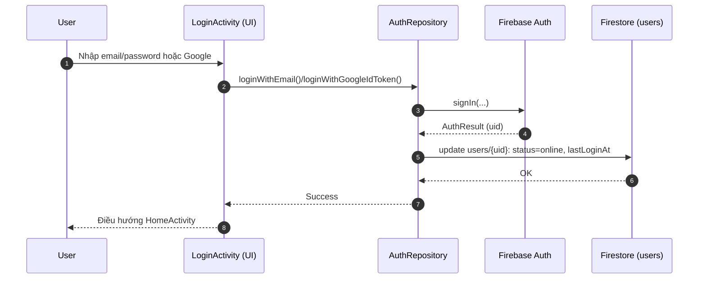

```mermaid
flowchart TD
    S[Start] --> CH{Chọn phương thức}
    CH -- Email/Password --> V[Validate email/password]
    CH -- Google --> G[Google Sign-In]
    V -->|OK| AUTH[Firebase Auth signIn]
    V -->|Sai| E1[Hiển thị lỗi]
    G --> AUTH
    AUTH -->|Thành công| UFS[Update users/{uid}: status, lastLoginAt]
    AUTH -->|Thất bại| E2[Thông báo đăng nhập thất bại]
    UFS --> H[Đi Home]
    E1 --> S
    E2 --> S
```

---

### UC-05 — Tìm kiếm/Khám phá nhóm
- **Actor chính**: Người dùng
- **Tác nhân phụ**: Firestore
- **Tiền điều kiện**: Đã đăng nhập; có kết nối mạng.
- **Hậu điều kiện (thành công)**: Trả về danh sách nhóm phù hợp; User có thể mở chi tiết nhóm.
- **Hậu điều kiện (thất bại)**: Trạng thái trống; không thay đổi dữ liệu.
- **Kích hoạt**: Người dùng mở `GroupsFragment`, nhập từ khóa.
- **Luồng chính**:
  1. User nhập từ khóa, bấm tìm kiếm.
  2. App gọi `GroupRepository.searchGroups(keyword)` → query Firestore (phân trang nếu cần).
  3. Trả kết quả; hiển thị danh sách nhóm; cho phép mở chi tiết.
- **Ngoại lệ/biến thể**:
  - E1: Không có kết quả → hiển thị empty state + gợi ý.
  - E2: Lỗi mạng → hiển thị thông báo, cho phép thử lại.

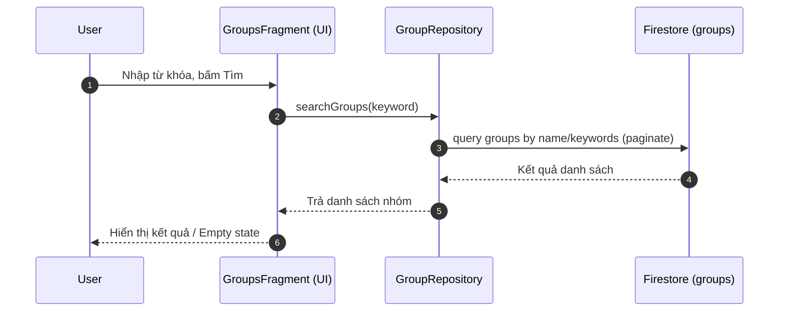

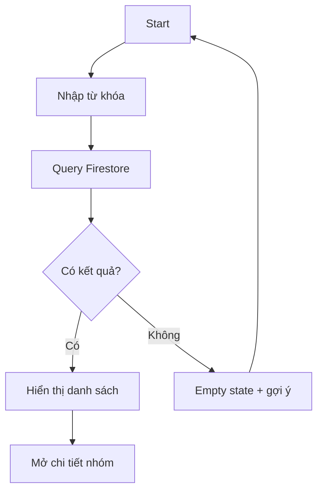

---

### UC-06 — Tham gia nhóm bằng mã mời
- **Actor chính**: Người dùng
- **Tác nhân phụ**: Firestore
- **Tiền điều kiện**: Có mã nhóm hợp lệ (6 ký tự); User chưa là thành viên nhóm.
- **Hậu điều kiện (thành công)**: Tạo `groups/{groupId}/members/{userId}`; cập nhật `memberCount` nếu có.
- **Hậu điều kiện (thất bại)**: Không thay đổi membership; thông báo lỗi/đang chờ duyệt (nếu nhóm private).
- **Kích hoạt**: Người dùng chọn “Nhập mã tham gia” ở `GroupsFragment`.
- **Luồng chính**:
  1. Nhập mã nhóm (6 ký tự) → Validate định dạng.
  2. Tìm nhóm bằng `code` trong `groups`.
  3. Nếu nhóm public hoặc auto-approve → tạo membership.
  4. Điều hướng vào feed nhóm.
- **Ngoại lệ/biến thể**:
  - E1: Mã không tồn tại → thông báo “Mã không hợp lệ”.
  - E2: Nhóm private yêu cầu duyệt → tạo yêu cầu tham gia, hiển thị trạng thái “Đang chờ”.
  - E3: Đã là thành viên → thông báo và mở nhóm.

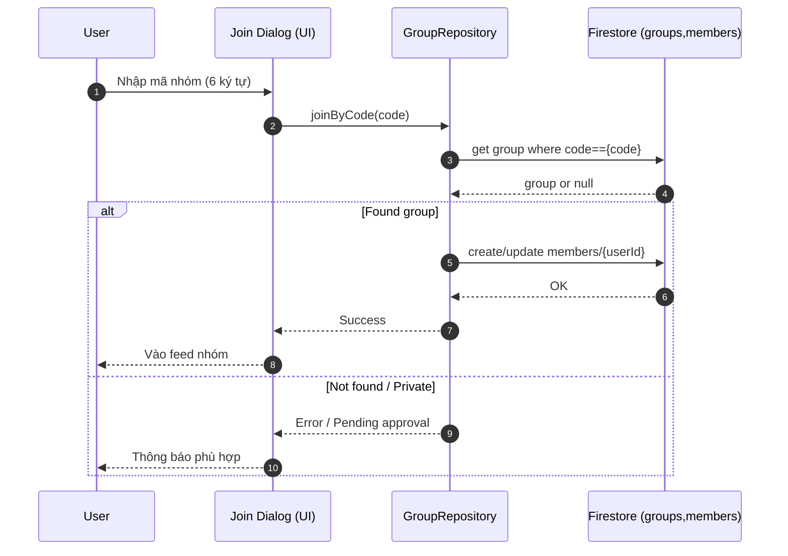

```mermaid
flowchart TD
    S[Start] --> V[Validate mã 6 ký tự]
    V --> Q[Tra cứu nhóm theo code]
    Q --> F{Tìm thấy?}
    F -- Không --> E1[Mã không hợp lệ]
    F -- Có --> P{Private cần duyệt?}
    P -- Có --> PEND[Tạo yêu cầu tham gia]
    P -- Không --> MEM[Tạo members/{userId}]
    PEND --> N[Thông báo 'Đang chờ']
    MEM --> H[Vào feed nhóm]
    E1 --> S
```

---

### UC-08 — Tạo bài viết (kèm ảnh)
- **Actor chính**: Người dùng (thành viên nhóm)
- **Tác nhân phụ**: Firebase Storage, Firestore
- **Tiền điều kiện**: User là member của nhóm; có quyền đăng; ảnh hợp lệ (≤5 ảnh, mỗi ảnh ≤10MB, JPEG/PNG).
- **Hậu điều kiện (thành công)**: Ảnh được upload; `posts/{postId}` tạo với `imageUrls`; feed cập nhật realtime.
- **Hậu điều kiện (thất bại)**: Không tạo post; dọn dẹp file tạm nếu có.
- **Kích hoạt**: `CreatePostActivity` → “Đăng”.
- **Luồng chính**:
  1. Nhập nội dung (≤1000 ký tự), chọn tối đa 5 ảnh.
  2. Nén ảnh, tuần tự/batch upload `putBytes` lên Storage → lấy `downloadUrl` danh sách.
  3. Tạo document Post trong `groups/{groupId}/posts/{postId}` (denormalized counters=0).
  4. UI điều hướng về feed/chi tiết bài viết mới.
- **Ngoại lệ/biến thể**:
  - E1: Ảnh vượt giới hạn/kích thước → thông báo, yêu cầu chọn lại.
  - E2: Upload thất bại → retry/huỷ; giữ nội dung soạn thảo.
  - E3: Quyền không đủ → hiển thị lỗi phân quyền.

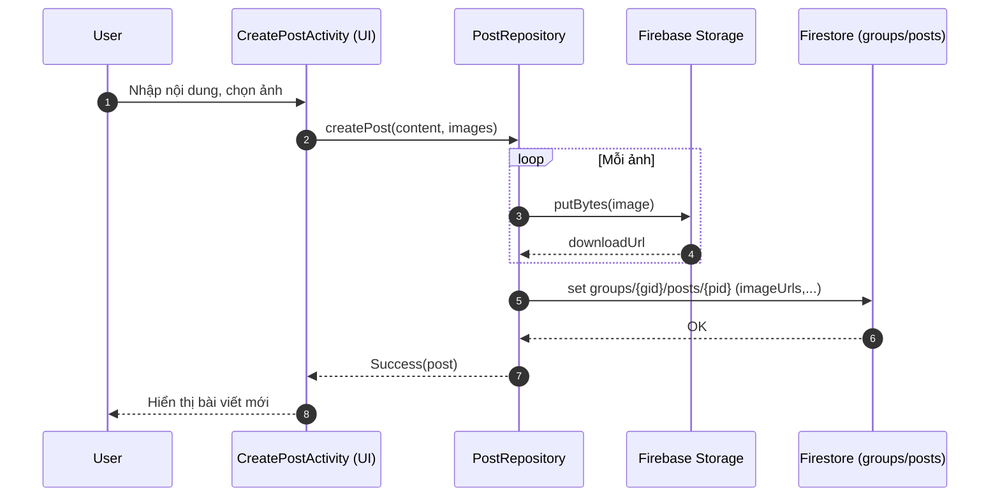

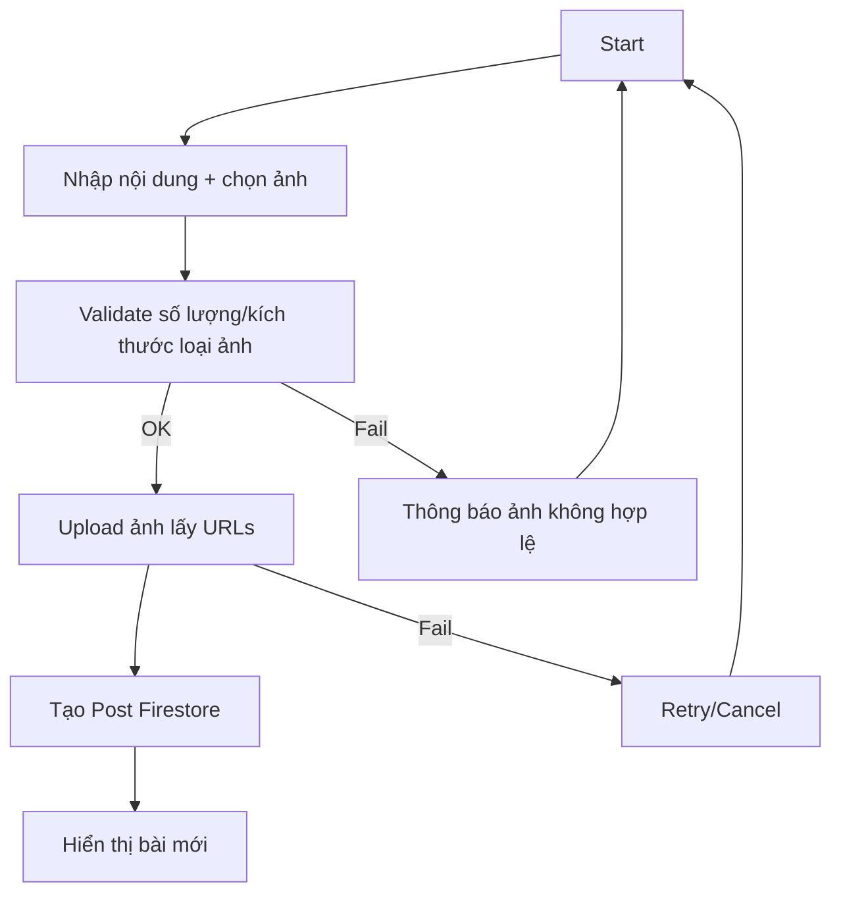

---

### UC-19 — Xác thực người dùng (Hệ thống)
- **Actor chính**: Ứng dụng (Client App)
- **Tác nhân phụ**: Firebase Auth, Firestore
- **Mục tiêu**: Xác thực danh tính user và phát hành phiên; đồng bộ hồ sơ người dùng.
- **Tiền điều kiện**: Client gửi cred (email/password) hoặc Google ID token.
- **Hậu điều kiện**: Token phiên hợp lệ; hồ sơ `users/{uid}` được tạo/merge; trạng thái online.
- **Luồng hệ thống**:
  1. Nhận yêu cầu sign‑in từ client cùng cred/token.
  2. Xác thực cred/token → sinh AuthResult (uid, tokens).
  3. Merge hồ sơ người dùng vào `users/{uid}` (set/merge các trường cơ bản).
  4. Trả kết quả cho client.

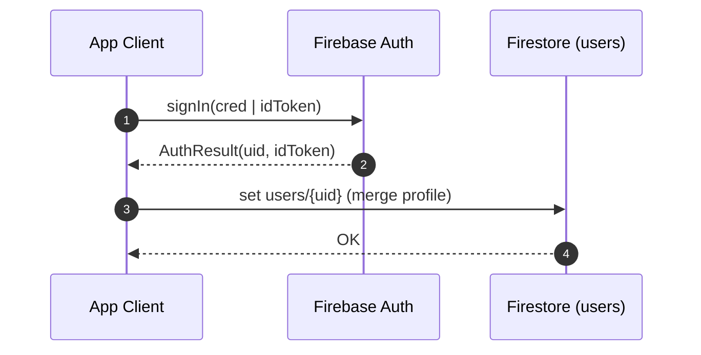

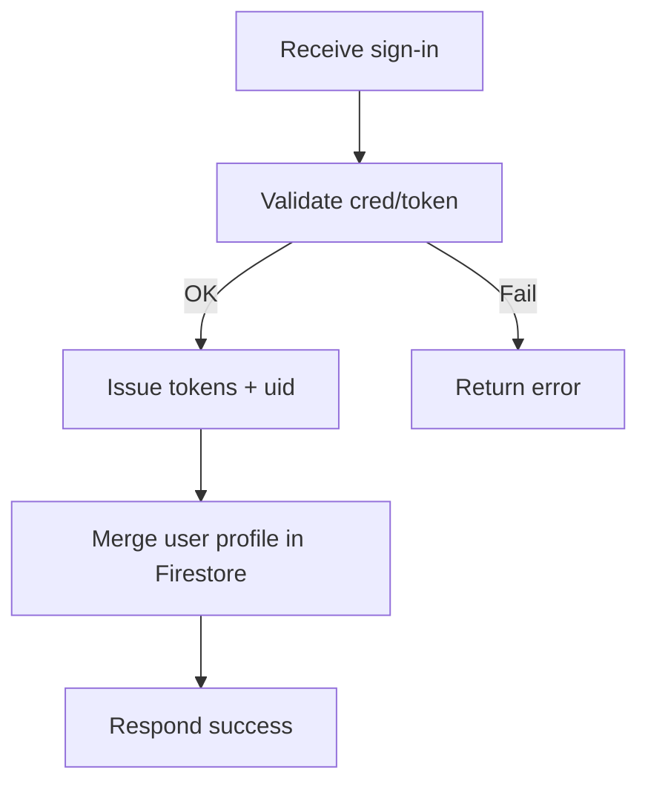

---

### UC-20 — Lưu trữ/Đồng bộ dữ liệu thời gian thực (Hệ thống)
- **Actor chính**: Ứng dụng (Client App)
- **Tác nhân phụ**: Firestore
- **Mục tiêu**: Cung cấp CRUD và kênh đồng bộ realtime (snapshot listeners) cho posts, comments, chats, events.
- **Luồng hệ thống (listener)**:
  1. Client đăng ký listener vào collection/query.
  2. Khi có thay đổi, Firestore push snapshot mới.
  3. Client cập nhật ViewModel/LiveData và hiển thị.
- **Luồng hệ thống (ghi dữ liệu)**:
  1. Client gửi create/update/delete.
  2. Firestore ghi; cập nhật counters denormalized qua transaction khi cần.
  3. Tự động kích hoạt listener liên quan.

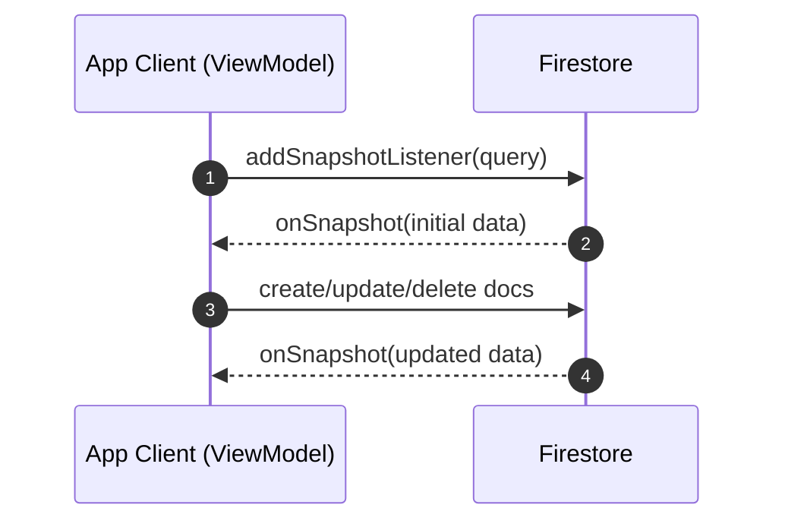

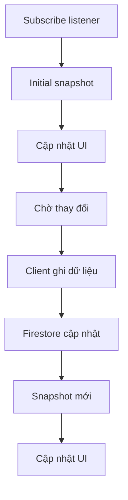

---

### UC-21 — Lưu trữ media (ảnh/file) (Hệ thống)
- **Actor chính**: Ứng dụng (Client App)
- **Tác nhân phụ**: Firebase Storage, Firestore (tham chiếu URL)
- **Mục tiêu**: Upload bytes → nhận download URL → gắn URL vào document (Post/Message/Group...).
- **Tiền điều kiện**: Dữ liệu media hợp lệ, kích thước trong giới hạn.
- **Hậu điều kiện**: File ở Storage; URL public (đã kiểm soát) được lưu trong Firestore.
- **Luồng hệ thống**:
  1. Client tạo đường dẫn đích phù hợp (`post_images/`, `group_images/`, `chat_images/{chatId}/...`).
  2. `putBytes`/`putFile` upload nội dung.
  3. Lấy `downloadUrl` sau upload thành công.
  4. Ghi URL vào document liên quan trong Firestore.

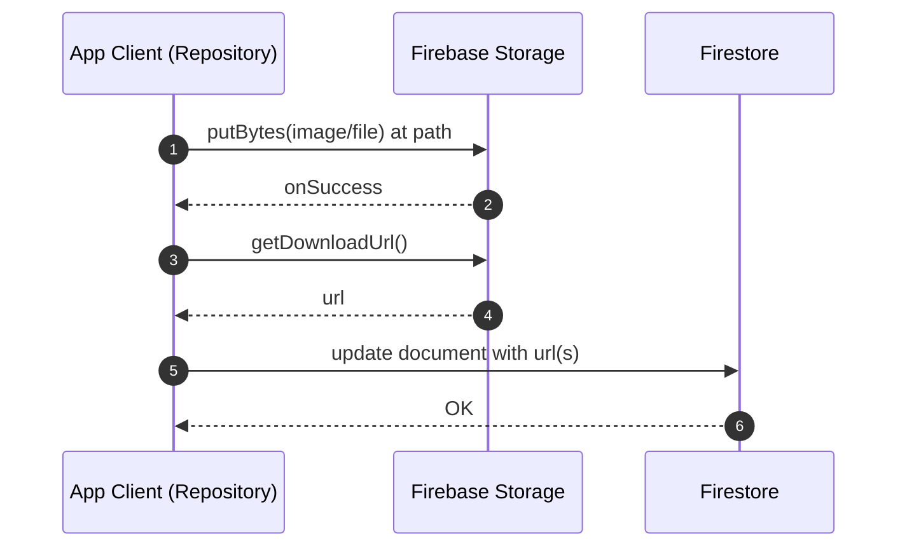

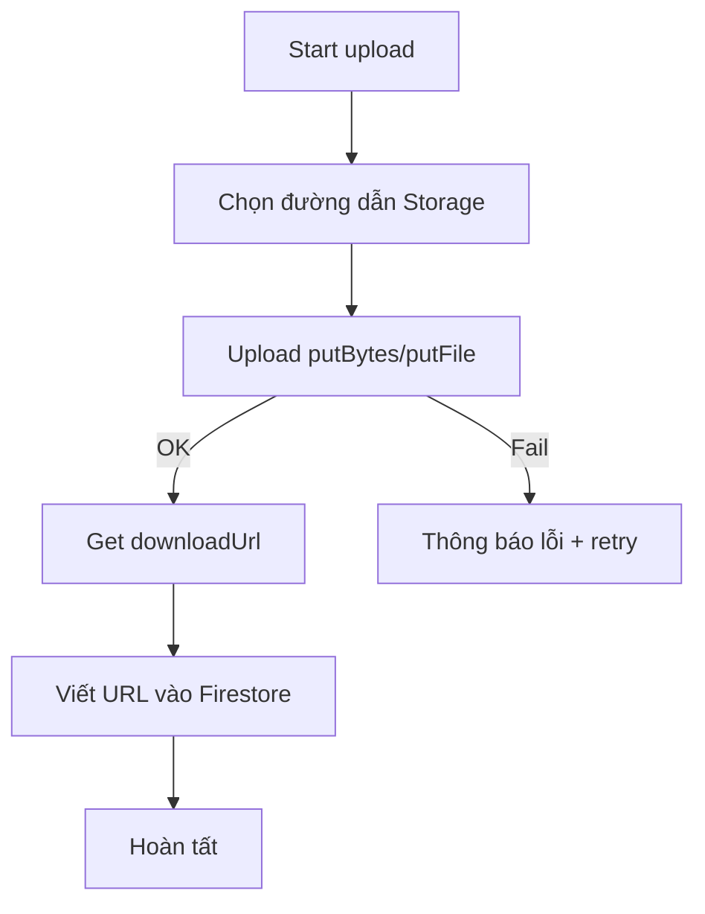
